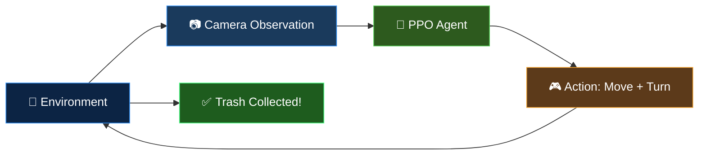

<div align="center">

# 🌊 Water Surface Trash Collector Bot

### An Autonomous RL Agent That Navigates Water to Collect Floating Trash

[](https://python.org)
[](https://github.com/openenv)
[](https://stable-baselines3.readthedocs.io/)
[](https://huggingface.co/spaces/ashu-17/water-trash-collector)
[](https://pygame.org)
[](LICENSE)

<br/>

```
  🤖 ROBOT          →→→         🗑️ TRASH
  ╔═══════╗     navigates      ╔═══════╗
  ║ Camera ║  ─────────────►   ║Collect!║
  ║ Sensor ║    autonomously   ║  +1.0  ║
  ╚═══════╝                    ╚═══════╝
```

**The robot sees trash through its camera, calculates the optimal path, and collects it — all learned through reinforcement learning!**

</div>

---

## 🎯 Project Overview

This project implements a complete **end-to-end reinforcement learning pipeline** for training an autonomous trash collector on a 2D water surface:



| Component | Description |
|-----------|-------------|
| 🌊 **Environment** | 100×100 water surface with floating trash, drift currents, and collision detection |
| 📷 **Camera System** | 6D observation vector simulating onboard camera + perception pipeline |
| 🧠 **RL Agent** | PPO (Proximal Policy Optimization) trained with stable-baselines3 |
| 🎮 **Interactive GUI** | PyGame desktop app + Gradio web interface with live camera feed |
| 🌐 **Deployment** | OpenEnv-compliant API deployed on HuggingFace Spaces |

---

## 🏆 Training Results

The agent achieves **100% collection rate** across all difficulty levels:

| Difficulty | Trash | Features | Collection Rate | Mean Reward | Mean Steps |
|:----------:|:-----:|:--------:|:---------------:|:-----------:|:----------:|
| 🟢 **Easy** | 1 | Fixed position | ✅ 100% | 1.059 | 60 |
| 🟡 **Medium** | 5 | Random positions | ✅ 100% | 1.032 | 36 |
| 🔴 **Hard** | 10 | Random + Water drift | ✅ 100% | 1.317 | 330 |

---

## 🏗️ Architecture

```
water_trash_env/
├── 📄 models.py                    # Pydantic Action/Observation models (OpenEnv)
├── 🎮 gui.py                       # PyGame desktop GUI with camera feed
├── 🌐 web_gui.py                   # Gradio web GUI for HuggingFace Spaces
├── 🏋️ gym_wrapper.py               # Gymnasium wrapper for RL training
├── 🧠 train.py                     # PPO training pipeline (stable-baselines3)
├── 🤖 inference.py                 # Gemini LLM + fallback agent
├── 📡 client.py                    # Typed OpenEnv client
├── 🐳 Dockerfile                   # HuggingFace Spaces deployment
├── 📦 pyproject.toml               # Python project config
├── 📝 openenv.yaml                 # OpenEnv manifest
├── server/
│   ├── app.py                      # FastAPI server (OpenEnv create_app)
│   └── water_trash_env_environment.py  # Core environment logic
└── trained_models/
    ├── best_model.zip              # Best checkpoint during training
    └── final_model.zip             # Final trained model
```

---

## 🎮 Environment Details

### Observation Space (Camera Input)
The robot's "camera" provides a 6-dimensional observation vector:

```python
observation = [
    robot_x,              # Robot X position (normalized)
    robot_y,              # Robot Y position (normalized)
    robot_theta,          # Heading angle (radians)
    nearest_trash_dist,   # Distance to nearest trash (from camera detection)
    nearest_trash_angle,  # Relative angle to nearest trash (from camera)
    trash_count,          # Remaining targets detected
]
```

### Action Space
```python
action = [
    linear_velocity,   # Forward/backward thrust  [-1.0, 1.0]
    angular_velocity,  # Turning rate              [-1.0, 1.0]
]
```

### Reward Design
```
+1.0 / total_trash   →  Per trash item collected
+0.001               →  Shaping: getting closer to nearest trash
Episode max: 400 steps or all trash collected
```

---

## 🚀 Quick Start

### 1. Clone & Install
```bash
git clone https://github.com/Ashutosh-177/Water-Trash-Collection-bot-2D-HF-Space.git
cd Water-Trash-Collection-bot-2D-HF-Space
pip install -e ".[dev]"
```

### 2. Run the Desktop GUI (PyGame)
```bash
# Watch the trained AI agent play
python gui.py --ai --task medium

# Manual control
python gui.py --task hard
```

**Controls:**
| Key | Action |
|-----|--------|
| `↑ ↓ ← →` | Move robot |
| `A` | Toggle AI/Manual |
| `1` / `2` / `3` | Easy / Medium / Hard |
| `R` | Reset episode |
| `Q` | Quit |

### 3. Run the Web GUI (Gradio)
```bash
python web_gui.py
# Open http://localhost:7860
```

### 4. Train Your Own Agent
```bash
# Train on medium difficulty
python train.py --task medium --steps 500000

# Train on hard (with water drift)
python train.py --task hard --steps 1000000

# Evaluate a trained model
python train.py --eval --task hard
```

### 5. Start the OpenEnv Server
```bash
uvicorn server.app:app --host 0.0.0.0 --port 8000
```

---

## 🌐 Live Demo

🔗 **Try it now:** [https://huggingface.co/spaces/ashu-17/water-trash-collector](https://huggingface.co/spaces/ashu-17/water-trash-collector)

Connect programmatically:
```python
from water_trash_env import WaterTrashAction, WaterTrashEnv

with WaterTrashEnv.from_env("ashu-17/water-trash-collector") as env:
    result = await env.step(WaterTrashAction(
        linear_velocity=1.0,
        angular_velocity=0.0
    ))
```

---

## 🔧 Tech Stack

<div align="center">

| Layer | Technology | Purpose |
|:-----:|:----------:|:-------:|
| 🧠 | **PPO (SB3)** | Reinforcement Learning |
| 🏋️ | **Gymnasium** | Environment Wrapper |
| 📡 | **OpenEnv + FastAPI** | API Server |
| 🎮 | **Pygame** | Desktop Visualization |
| 🌐 | **Gradio** | Web Interface |
| 🤖 | **Gemini API** | LLM Inference Agent |
| 🐳 | **Docker** | Containerization |
| 🤗 | **HuggingFace Spaces** | Cloud Deployment |

</div>

---

## 📊 Training Curves

The PPO agent converges rapidly:

```
Step     0K → Reward: 0.12  (random exploration)
Step   100K → Reward: 0.78  (learning to navigate)
Step   300K → Reward: 1.02  (collecting all trash)
Step   500K → Reward: 1.03  (optimized paths)
Step  1000K → Reward: 1.32  (hard mode mastered!)
```

---

## 👤 Author

**Ashutosh**

---

<div align="center">

*Built with ❤️ for cleaner oceans, one pixel at a time* 🌊🤖

</div>
