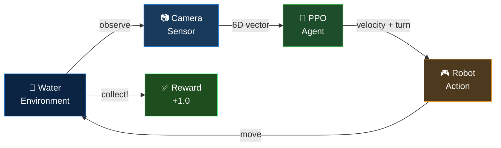
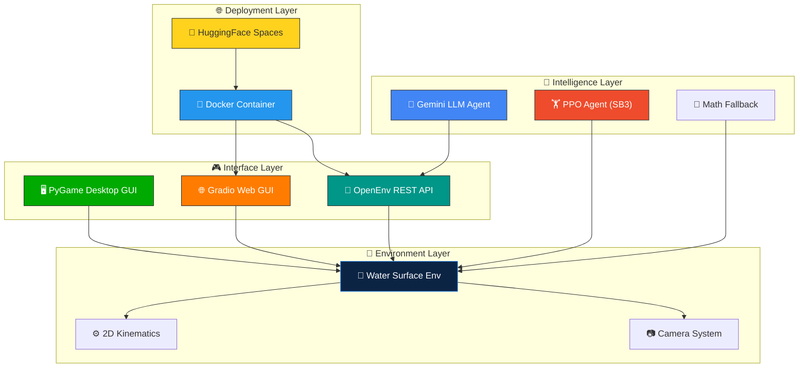

<div align="center">

<!-- Animated Header -->


<!-- Typing Animation -->
<a href="https://git.io/typing-svg"></a>

<br/>

<!-- Badges -->
[](https://python.org)
[](https://pytorch.org)
[](https://github.com/openenv)
[](https://huggingface.co/spaces/ashu-17/water-trash-collector)
[](https://pygame.org)
[](LICENSE)

<br/>

<!-- Star/Fork Badges -->


</div>

<!-- Wave Separator -->


## 🎬 Demo

<div align="center">

```
    🌊🌊🌊🌊🌊🌊🌊🌊🌊🌊🌊🌊🌊🌊🌊🌊🌊🌊🌊🌊🌊🌊🌊
    🌊                                                🌊
    🌊    🤖 ──────────►  🗑️   COLLECTED! ✅         🌊
    🌊         robot        trash    +1.0 reward       🌊
    🌊                                                🌊
    🌊    📷 Camera ─► 🧠 PPO Agent ─► 🎮 Action      🌊
    🌊                                                🌊
    🌊🌊🌊🌊🌊🌊🌊🌊🌊🌊🌊🌊🌊🌊🌊🌊🌊🌊🌊🌊🌊🌊🌊
```

**▶ [Try Live Demo on HuggingFace Spaces](https://huggingface.co/spaces/ashu-17/water-trash-collector)**

</div>


## 🎯 What is this?

> **An end-to-end Reinforcement Learning project** where an autonomous robot learns to navigate a 2D water surface, detect floating trash using its camera, and collect every piece — trained entirely through self-play using PPO.

<div align="center">



</div>


## 🏆 Training Results

<div align="center">

The agent achieves **100% collection rate** across ALL difficulty levels!

| | Difficulty | Trash Items | Special Features | Collection | Reward | Steps |
|:---:|:---:|:---:|:---:|:---:|:---:|:---:|
| 🟢 | **Easy** | 1 | Fixed position | **✅ 100%** | 1.059 | 60 |
| 🟡 | **Medium** | 5 | Random spawn | **✅ 100%** | 1.032 | 36 |
| 🔴 | **Hard** | 10 | Random + Drift 🌊 | **✅ 100%** | 1.317 | 330 |

</div>

### 📈 Training Progress
```
Timestep    Reward    Status
─────────────────────────────────────────
     0K     0.12     ❌ Random exploration
   100K     0.78     🔄 Learning to navigate  
   300K     1.02     ✅ Collecting all trash
   500K     1.03     ⚡ Path optimization
 1,000K     1.32     🏆 HARD MODE MASTERED!
─────────────────────────────────────────
```


## 🏗️ Project Architecture

<div align="center">



</div>

### 📂 File Structure

```
🌊 water_trash_env/
│
├── 🧠 Core
│   ├── server/water_trash_env_environment.py   # Environment physics & logic
│   ├── models.py                               # OpenEnv Action/Observation models
│   └── gym_wrapper.py                          # Gymnasium wrapper for RL
│
├── 🎮 Interfaces
│   ├── gui.py                                  # PyGame desktop GUI + camera feed
│   ├── web_gui.py                              # Gradio web GUI (HF Spaces)
│   └── server/app.py                           # FastAPI OpenEnv server
│
├── 🤖 Agents
│   ├── train.py                                # PPO training pipeline (SB3)
│   ├── inference.py                            # Gemini LLM + fallback agent
│   └── client.py                               # Typed OpenEnv client
│
├── 📦 Config
│   ├── Dockerfile                              # HF Spaces deployment
│   ├── pyproject.toml                          # Python project config
│   └── openenv.yaml                            # OpenEnv manifest
│
└── 🏋️ Models
    └── trained_models/
        ├── best_model.zip                      # Best training checkpoint
        └── final_model.zip                     # Final trained model
```


## 🎮 Environment Details

<div align="center">

### 📷 Observation Space (Camera Input)

</div>

The robot's onboard camera provides a **6-dimensional** observation:

```python
observation = {
    "robot_x":              # 📍 Robot X position (normalized to grid)
    "robot_y":              # 📍 Robot Y position (normalized to grid)  
    "robot_theta":          # 🧭 Heading angle (radians)
    "nearest_trash_dist":   # 📏 Distance to nearest trash (camera detection)
    "nearest_trash_angle":  # 🎯 Relative angle to nearest trash
    "trash_count":          # 🔢 Remaining targets detected by sensor
}
```

### 🎮 Action Space

```python
action = {
    "linear_velocity":  [-1.0, 1.0]    # ⬆️⬇️ Forward/backward thrust
    "angular_velocity": [-1.0, 1.0]    # ↩️↪️ Turning rate
}
```

### 🏅 Reward Design

| Event | Reward | Purpose |
|:-----:|:------:|:-------:|
| 🗑️ Collect trash | `+1.0 / total` | Per-item collection bonus |
| 📏 Get closer | `+0.001` | Shaping: encourage approach |
| ⏰ Time limit | 400 steps max | Encourage efficiency |


## 🚀 Quick Start

### 📥 1. Clone & Install

```bash
git clone https://github.com/Ashutosh-177/Water-Trash-Collection-bot-2D-HF-Space.git
cd Water-Trash-Collection-bot-2D-HF-Space
pip install -e ".[dev]"
```

### 🖥️ 2. Desktop GUI (PyGame)

```bash
# 🤖 Watch AI agent play
python gui.py --ai --task medium

# 🎮 Manual control
python gui.py --task hard
```

<div align="center">

| Key | Action | | Key | Action |
|:---:|:------:|:---:|:---:|:------:|
| `↑` `↓` `←` `→` | Move robot | | `A` | Toggle AI/Manual |
| `1` / `2` / `3` | Easy / Med / Hard | | `R` | Reset episode |
| `Q` | Quit | | `C` | Toggle camera |

</div>

### 🌐 3. Web GUI (Gradio)

```bash
python web_gui.py
# 🔗 Open http://localhost:7860
```

### 🧠 4. Train Your Own Agent

```bash
# Train on medium (5 trash items)
python train.py --task medium --steps 500000

# Train on hard (10 trash + water drift) 
python train.py --task hard --steps 1000000

# Evaluate trained model
python train.py --eval --task hard
```

### 📡 5. OpenEnv Server

```bash
uvicorn server.app:app --host 0.0.0.0 --port 8000
```


## 🌐 Live Demo & API

<div align="center">

### ▶️ [Launch Live Demo on HuggingFace Spaces](https://huggingface.co/spaces/ashu-17/water-trash-collector)

</div>

Connect programmatically:

```python
from water_trash_env import WaterTrashAction, WaterTrashEnv

with WaterTrashEnv.from_env("ashu-17/water-trash-collector") as env:
    obs = await env.reset(task_level="hard")
    
    while not obs.done:
        action = WaterTrashAction(linear_velocity=1.0, angular_velocity=0.0)
        obs = await env.step(action)
        print(f"Trash remaining: {obs.trash_count}")
```


## 🔧 Tech Stack

<div align="center">

| | Technology | Purpose |
|:---:|:---:|:---:|
| 🧠 | **PPO (Stable-Baselines3)** | Reinforcement Learning Algorithm |
| 🏋️ | **Gymnasium** | Environment Wrapper & Interface |
| 📡 | **OpenEnv + FastAPI** | REST/WebSocket API Server |
| 🎮 | **Pygame** | Desktop GUI with Camera Feed |
| 🌐 | **Gradio** | Web Interface (HF Spaces) |
| 🤖 | **Google Gemini** | LLM Inference Agent |
| 🐳 | **Docker** | Containerized Deployment |
| 🤗 | **HuggingFace Spaces** | Cloud Hosting |
| 🐍 | **Pydantic** | Type-safe Data Models |

</div>


## 👤 Author

<div align="center">

**Ashutosh**

[](https://github.com/Ashutosh-177)

</div>


<div align="center">

### ⭐ Star this repo if you found it interesting!

*Built with ❤️ for cleaner oceans, one pixel at a time* 🌊🤖

</div>

<!-- Animated Footer -->

